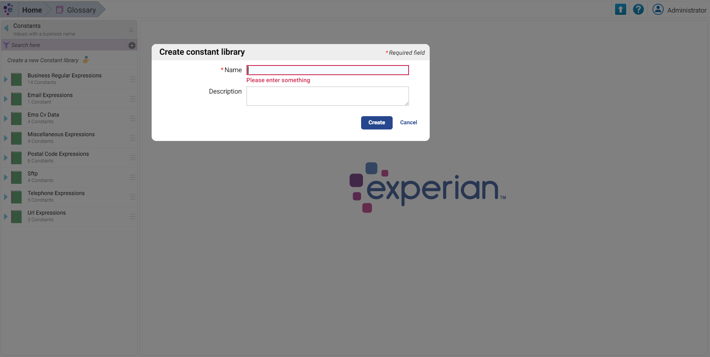
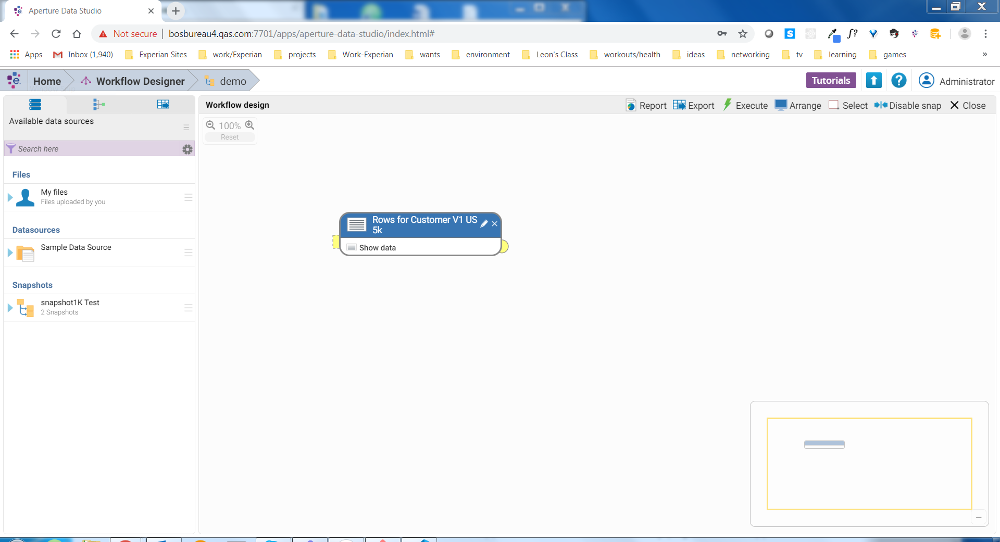
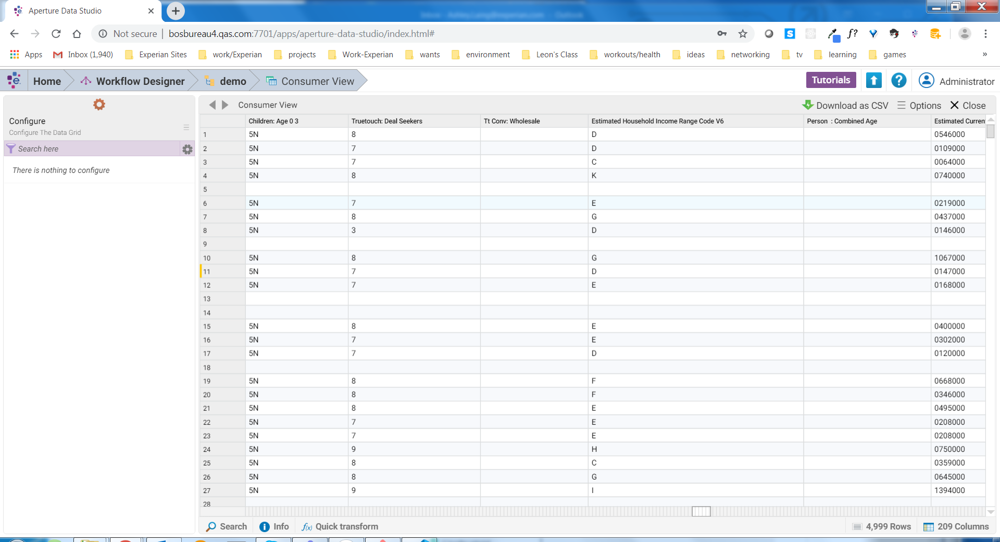
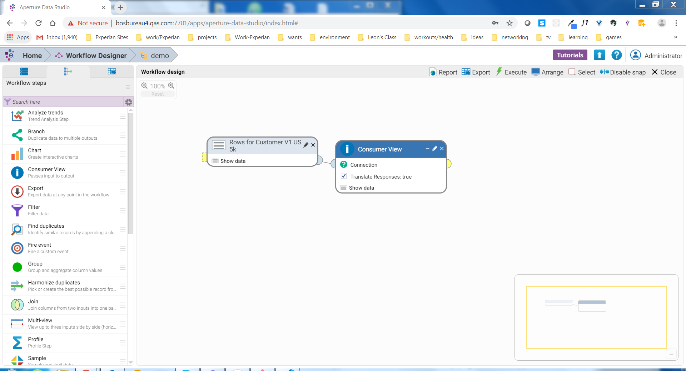
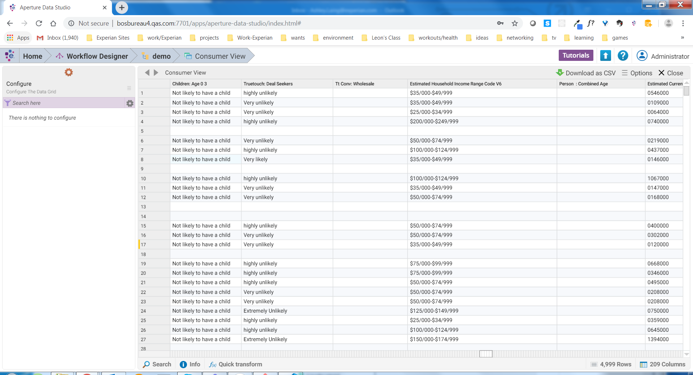

# Aperture Data Studio Consumer View Integration
Written By Ashley Laing

## Overview

Experian Data Quality is now introducing enrichment into Aperture Data Studio.
Experian Marketing Services and EDQ have collaborated to integrate Consumer View Data into Aperture Data Studio.

## Installation prerequisites
Before starting, it's important to make sure you have access to the following
things:

* Aperture Data Studio
* The .jar file for the step
* Administrator access to the Glossary

## Installation instructions

For the purposes of this tutorial we will assume you have already installed and logged into Aperture Data Studio.

### Step 1
You will need the jar file for the Consumer View Add-on Step. Download the jar that is given to you by EDQ, and drop it into C:\Program Files\Experian\Aperture Data Studio 1.5.1\addons (the folder name Aperture Data Studio 1.5.1 should end in the version of Aperture Data Studio you are using). Refresh the browser after.

### Step 2
Next, you will need to add the license key into the glossary.
After you’re logged in to Aperture Data Studio, on the home screen click on the Glossary.

Once in the Glossary click on Constants.

Create a new Constant Library and give it a name (ie ConsumerView).

Create a Business Constant.

You will name the Business Constant EDQ_TOKEN, and the value will be the license key you got during the onboarding process from EDQ.

## Using The Consumer View Add-on Step

### Step 1
When using the Consumer View Step, you must have your table data tagged.
Instructions on how to data tag your tables is located in the [Aperture Data Studio User Guide](https://www.edq.com/documentation/aperture-data-studio/user-guide/#data-tagging).

Once you tagged the table, the header should look like this header with word bubbles in the tagged headers:

### Step 2
After data tagging the table, create your workflow in the Workflow Designer.

### Step 3
Select your table and put together your workflow to meet your needs.
The Consumer View step is called "Custom - Consumer View", it will be in the sidebar to the left.

### Step 4
For the Consumer View Step, you will see a checkbox that will control if the reponses get translated or stays in their orginal coded response.

Leave the box unchecked and it will leave the responses in the orginal form.

Check the box and the responses will be translated to values that make it clear of the meaning.

### Step 5
Once you have finished configuring your workflow, you can click on "Show data" to see the results.

## Troubleshooting

1. Leading Zero Missing

Data Studio will sometimes remove leading zeros for standardization. It is important to avoid this on the zip code/postal code column, as the API relies on a full zip code to make a match. To maintain leading zeros, go to Data Explorer and right click on the file. In the drop down menu, select "Preview and configure". Right click on the zip code/postal code column and select "Edit." In the pop up window, turn off all standardization options for that column by toggling each switch into the "Off" position.

2. No More Clicks

When you get this message in your table, that means you need to call EDQ to recieve a new token to buy more clicks. Either you have ran out or the table has more records than your remaining clicks.

## FAQs

1. What columns to tag?

I would recommend using the following data tags:
    You must use:
        -Name for full name (if name is separated, use Forenames and Surname)
        -Postal Code or Zip Code
    In addition you can use:
        -Email if the column is there (not required though)
        -Address or Premise and Street
        -City
        -State

2. Why do I only get data back for US records?

This Integration only works for USA data.

3. How does ConsumerView Add-on know it is a US record?

The ConsumerView Step uses the Zip code and checks to see if it is a US formatted zipcode.

4. Will the records process if I don't have the data tags?

The table won't generate. It uses the datatags to find the information needed to get back data. 

5. How to check my remaining transactions?

There is a separate step that will allow you to view how many clicks are left.