# Aperture Data Studio Consumer View Integration
Written By Ashley Laing

## Overview

Experian Data Quality has updated the enrichment step, Consumer View, into Aperture Data Studio 2.0. Experian Marketing Services and EDQ have collaborated to integrate Consumer View Data into Aperture Data Studio.

## Installation prerequisites
Before starting, it's important to make sure you have access to the following
things:

* Aperture Data Studio
* The .jar file for the step

## Installation instructions

For the purposes of this tutorial we will assume you have already installed and logged into Aperture Data Studio.

### Step 1
You will need the jar file for the Consumer View Add-on Step. Download the jar that is given to you by EDQ.

### Step 2
Stop the Experian Aperture Data Studio Database Server 2.0.16 64bit (or what ever version of Aperture Data Studio you have)

### Step 3
Place the jar into C:\Program Files\Experian\Aperture Data Studio 2.0.16\addons (the folder name Aperture Data Studio 2.0.16 should end in the version of Aperture Data Studio you are using), if you cannot find it on the C drive look on the drive you had downloaded Aperture Data Studio.

### Step 4
 Restart the Aperture Data Studio Server service so that the add-on will be added.

### Step 5
Next, you will need to add the license key into the step setting for the Consumer View Step (Look at the Change the Token Section)

## Using The Consumer View Add-on Step

### Step 1
After you create your workflow:

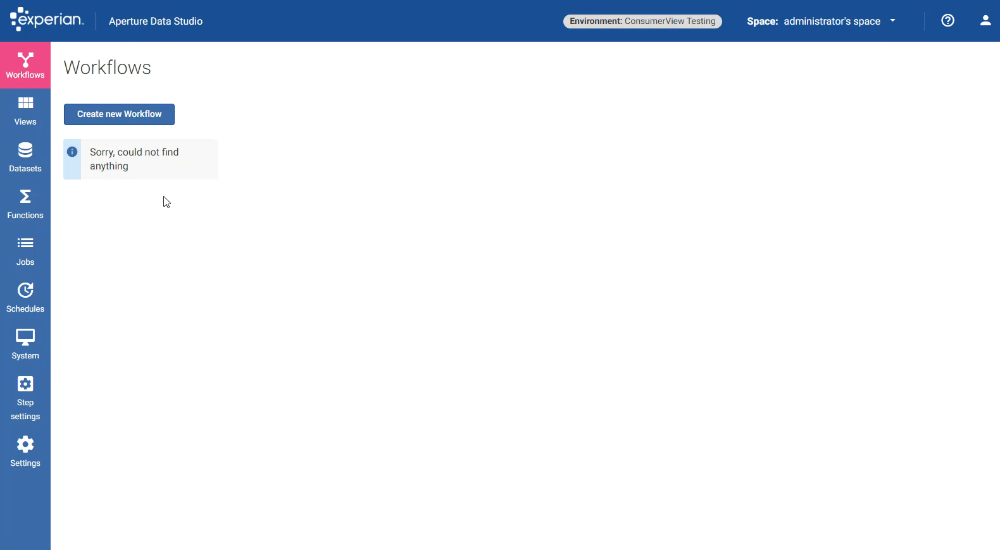
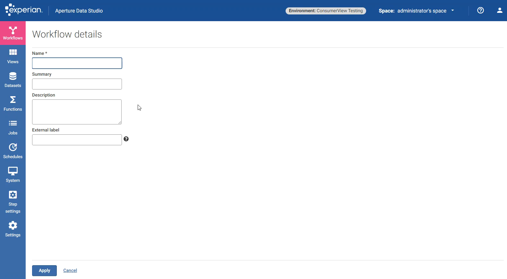
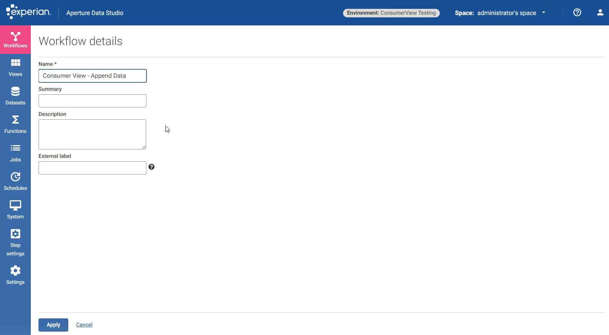

Pick your datasource, view, or snapshot.

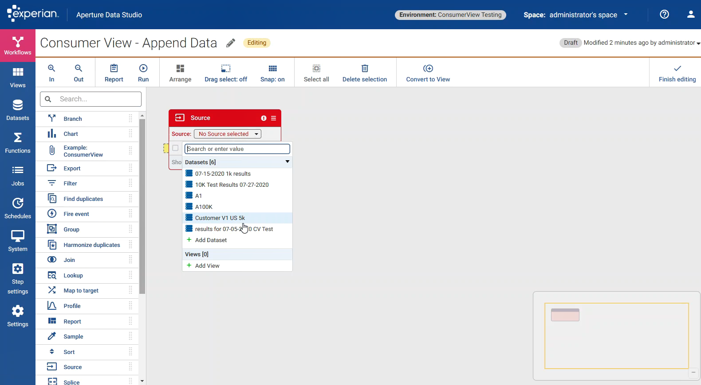

### Step 2
Select the Consumer View Step from the Steps List. The step will select the tagged columns.

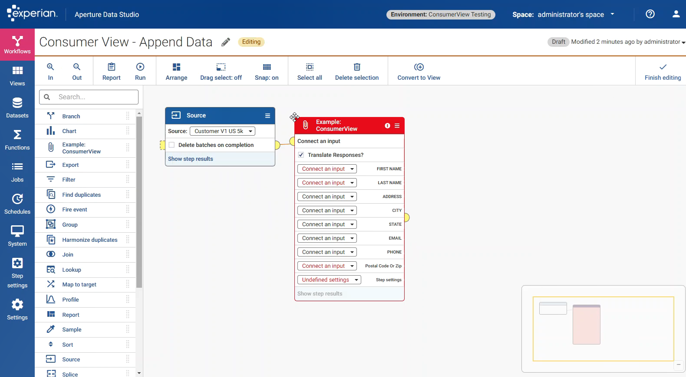
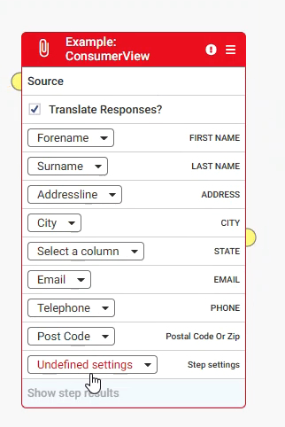

### Step 3
Select the columns that are not tagged and the token for Consumer View in the step settings dropdown.

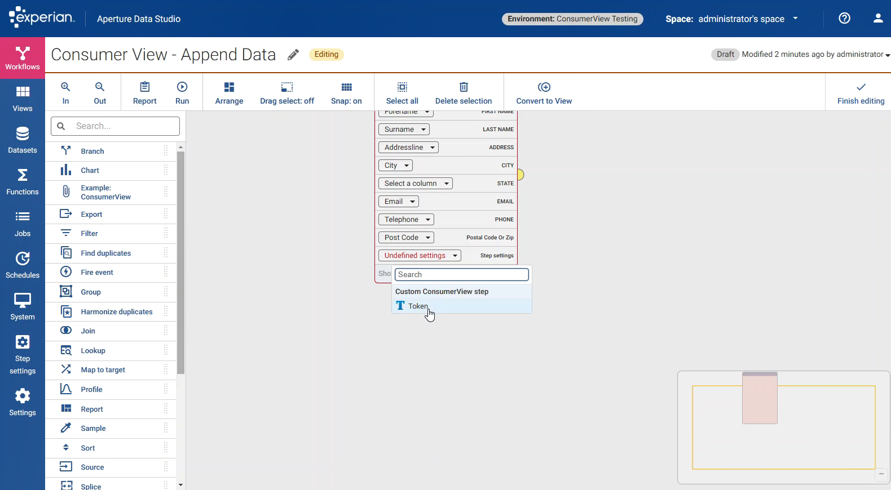

### Step 4
Add a Take snapshot step from the steps list to the end for the information to be used in another workflow, depending on your solution. 

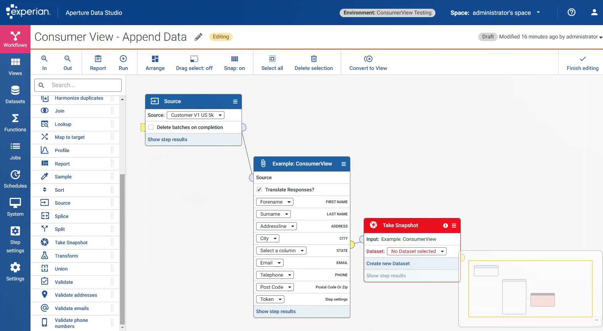

### Step 5
Add any other steps from the Step List that you need to achieve your goal with the data.

## Changing the token

### Step 1
Go to Step Settings.
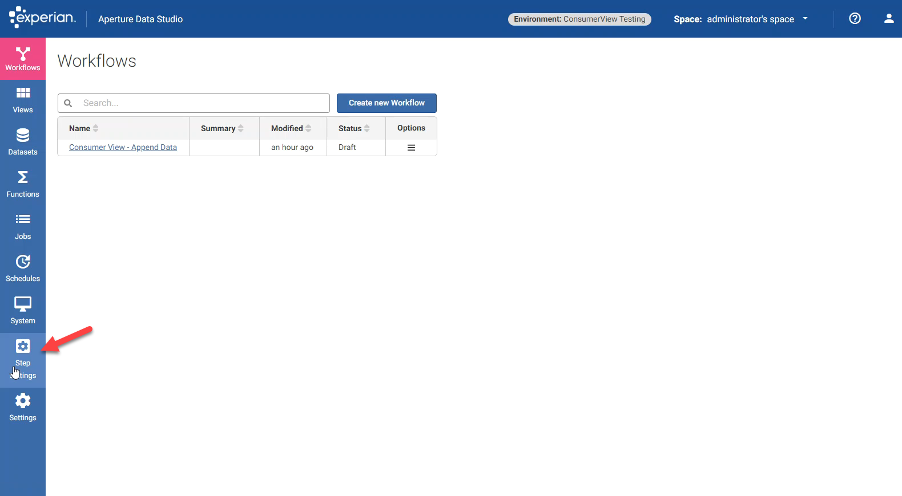

### Step 2
Select the Consumer View Settings.
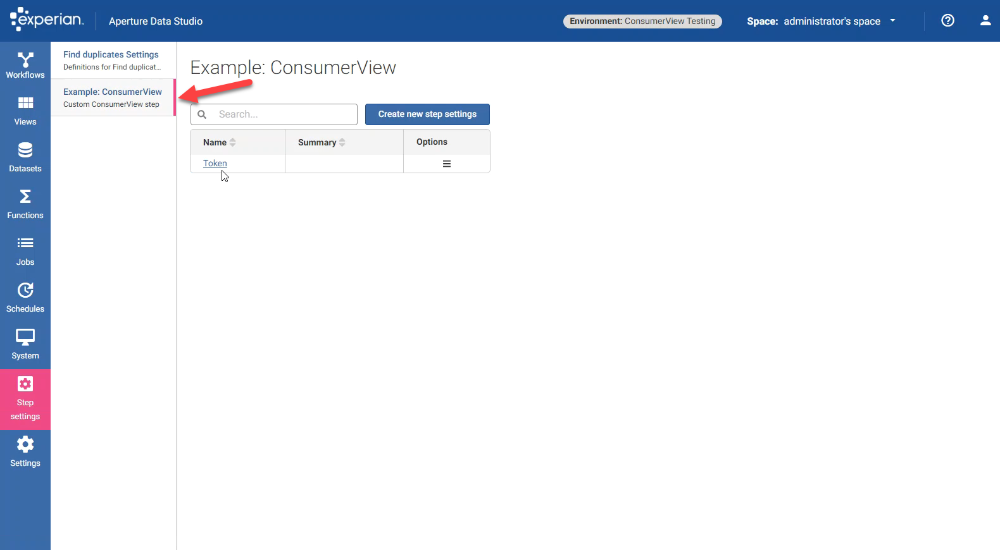

### Step 3
If you are putting in the token for the first time, then press Create new step settings.
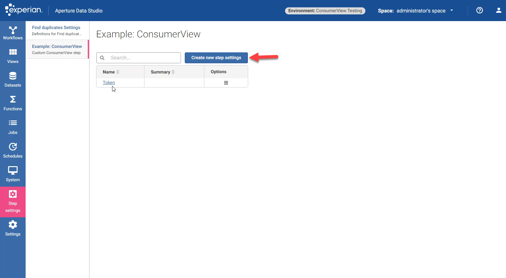

Otherwise, click on the name of the token setting.
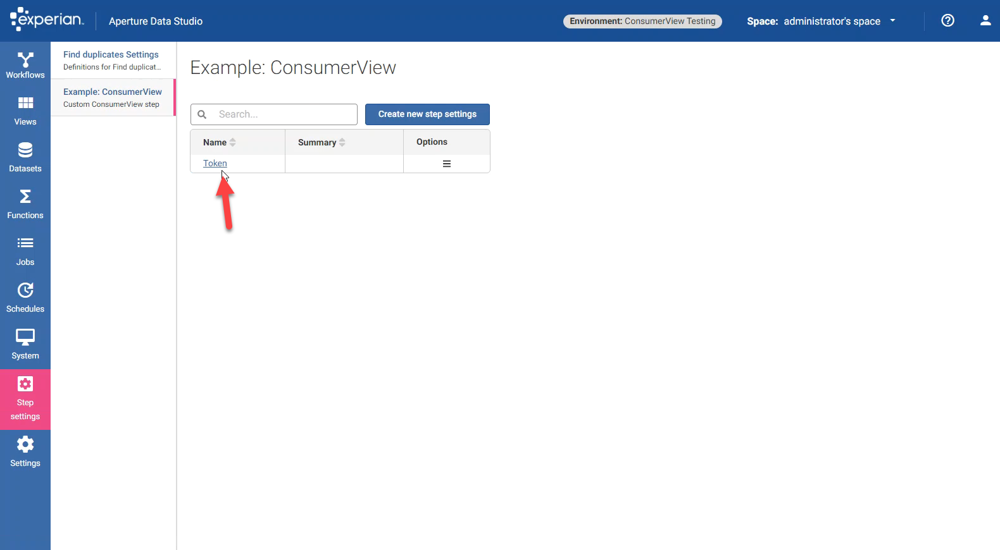

### Step 4
Inputting a new token, fill out the Name and Token required fields.

Otherwise, when changing the token to a new one, delete the old token in the Token field and put in the new token in that field.

Press Apply.

### Step 5
When you run Consumer View Step again the token will change.

## Troubleshooting

## FAQs

1. What columns to tag?

I would recommend using the following data tags:
    You must use:
        -Name for full name (if name is separated, use Forenames and Surname)
        -Postal Code or Zip Code
    In addition you can use:
        -Email if the column is there (not required though)
        -Address or Premise and Street
        -City
        -State

2. Why do I only get data back for US records?

This Integration only works for USA data.

3. How does ConsumerView Add-on know it is a US record?

The ConsumerView Step uses the Zip code and checks to see if it is a US formatted zipcode.

4. How to check my remaining transactions?

There is a separate step that will allow you to view how many clicks are left.