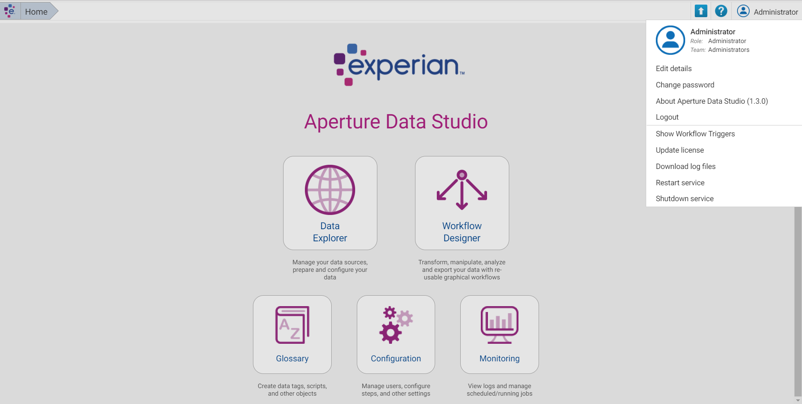
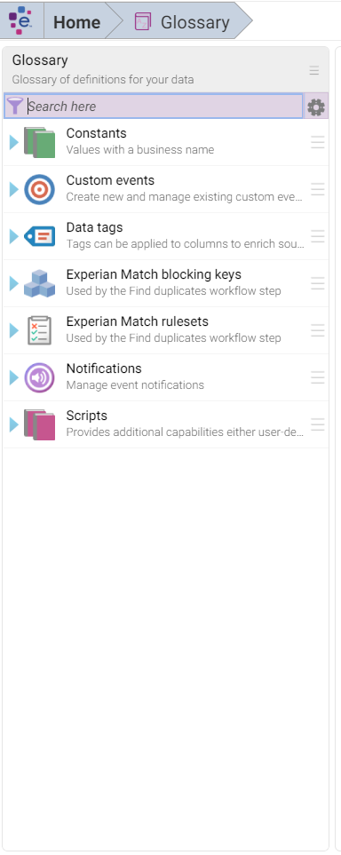
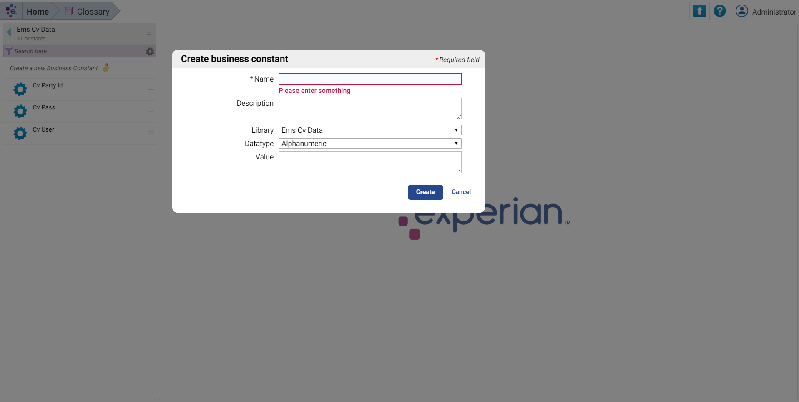
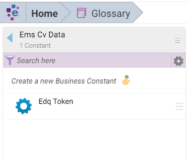
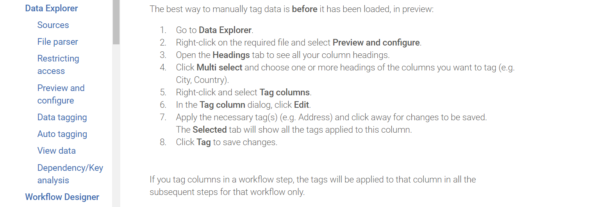
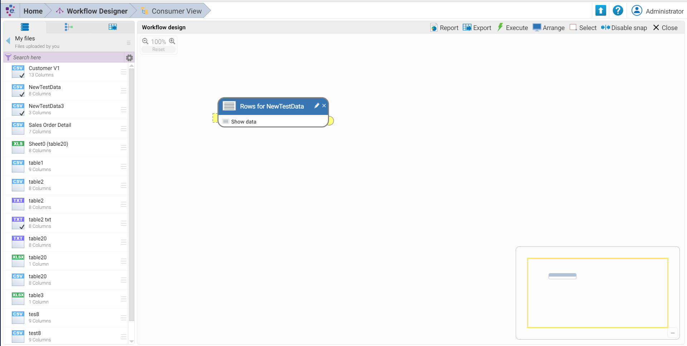

Written By Ashley Laing
# Overview

Experian Data Quality is now introducing enrichment into Aperture Data Studio.
Experian Marketing Services and EDQ have combined to integrate Consumer View Data into Aperture Data Studio.

# Installation prerequisites
Before starting, it's important to make sure you have access to the following
things:

* Aperture Data Studio
* The JAR file for the step
* Administrator access to the Glossary

# Installation instructions

For the purposes of this tutorial we will assume you have already installed and logged into Aperture Data Studio.

## Step 1
You will need the jar file for the Consumer View Add-on Step. What you will need to do is download the jar and drop it into C:\Program Files\Experian\Aperture Data Studio 1.3.0\addons (the folder Aperture Data Studio 1.3.0 should end in the version of Aperture you are using).

## Step 2
Now lets restart the server.

## Step 3
Once the server is running again, you will need to add the license key into the glossary.
After you’re logged in to Aperture Data Studio, on the home screen click on the Glossary.

Once in the Glossary click on Constants.

Create a new Constant Library and give it a name.

Create 3 Business Constant.

You will name the Business Constant EDQ_TOKEN, and the value will be the license key you got during the onboarding process from EDQ.

# Using The Consumer View Add-on Step

## Step 1
When using the Consumer View Step, you must have your table data tagged.
Instructions on how to data tag your tables is located in the [Aperture Data Studio User Guide](https://www.edq.com/documentation/aperture-data-studio/user-guide/).

Once you tagged the table, the header should look like this header with word bubbles in the tagged headers:

## Step 2
After data tagging the table, you can go create your workflow in the Workflow Designer.

## Step 3
Select your table and put together your workflow to meet your needs.
They will be in the sidebar on the left.

## Step 4
For the Consumer View Step, you will see 12 predefined Bundles, you will only be able to use the purchased bundles. Select as many purchased bundles as you may.

## Step 5
If the Record Completion feature was purchased, you also have the ability to have two completion options. Name Completion and Address Completion.

## Step 6
Once you are set with your workflow, you can click on show data to see the results.
